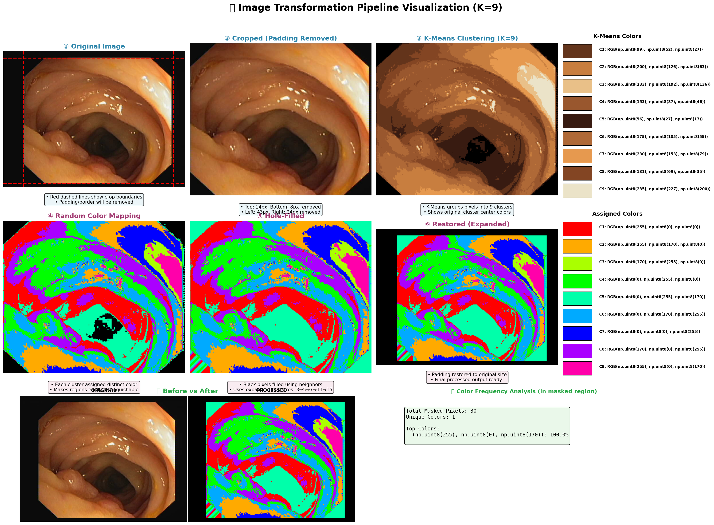
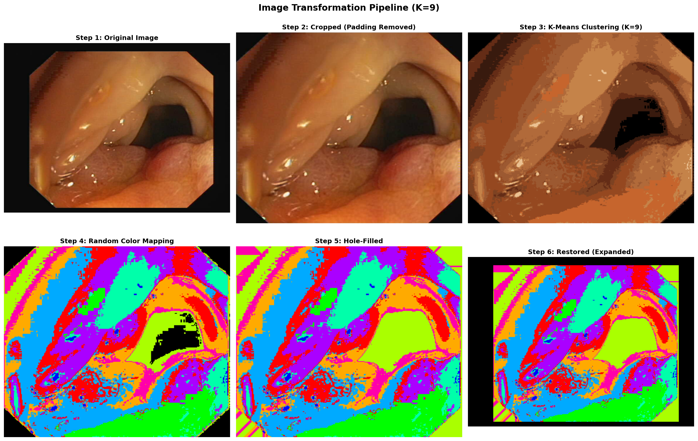

# K-Means Image Dissection Pipeline

## Overview

This project implements a K-Means clustering-based image processing pipeline for analyzing and segmenting polyp images. The pipeline transforms medical images by clustering pixel colors, applying distinctive color labels, and analyzing color distributions within masked regions.

## Process Workflow

### 1. Image Loading
- Load polyp images from the `subi/` directory
- Handle RGBA to RGB conversion if needed
- Preserve original image dimensions for restoration

### 2. Border Cropping
- Automatically detect and remove border regions using a tolerance-based approach
- Calculate border color by averaging corner pixels
- Identify non-border lines using a 90% threshold
- Store crop bounds for later restoration

### 3. K-Means Clustering
- Apply K-Means clustering (default K=9) to segment image pixels
- **Key Feature**: Exclude border-colored pixels from clustering to focus on actual image content
- Use `sklearn.cluster.KMeans` with:
  - `n_clusters=K`
  - `random_state=42` for reproducibility
  - `n_init=10` for robust initialization

### 4. Random Color Generation
- Generate visually distinct colors for each cluster using HSV color space
- Evenly distribute hues across the color wheel
- Convert to RGB for final output
- Makes cluster boundaries clearly visible

### 5. Clustered Image Creation
- Map each pixel to its cluster's assigned random color
- Create a color-coded visualization of the segmentation

### 6. Hole Filling Algorithm
- Fill black (border) pixels that remain inside the image
- Use iterative neighborhood-based filling with box sizes: [3, 5, 7, 11, 15]
- Process pixels from center outward for better results
- Use most common neighboring color for filling

### 7. Restoration to Original Shape
- Restore processed image to original dimensions
- Place processed content back within original crop bounds
- Preserve consistent output size

### 8. Batch Processing
- Process multiple images from `subi/` directory
- Save colorized outputs to `subcolr/` directory
- Toggle processing with `RUN_PROCESSING` flag

## Key Files

| File | Description |
|------|-------------|
| `kmeandisection.ipynb` | Main notebook with K-Means dissection pipeline |
| `subi/` | Input images directory (source polyp images) |
| `subcolr/` | Output directory (K-Means colorized images) |
| `subgt/` | Ground truth masks directory |
| `kmeans_confidence.py` | Confidence scoring utilities |
| `transformation_pipeline_visualization.png` | Visual showing the complete pipeline |
| `transformation_steps.png` | Step-by-step transformation visualization |

## Analysis Features

### Color Frequency Analysis
- Calculate color distribution within white mask regions
- Track percentage of each color cluster
- **Key Metric**: Sum of top 3 color percentages indicates segmentation quality

### Visualization
- Side-by-side comparison of:
  - Original input image
  - Predicted output
  - K-Means colorized version
  - Ground truth mask

## Usage

```python
# Configure parameters
K = 9                    # Number of clusters
RUN_PROCESSING = True    # Set to True to process images

# Process a single image
result = process_image('input.png', 'output.png', k=K)
```

## Dependencies

- `numpy` - Numerical operations
- `matplotlib` - Visualization
- `PIL (Pillow)` - Image handling
- `opencv-python (cv2)` - Image processing & color conversion
- `scikit-learn` - K-Means clustering
- `pandas` - Data analysis

## Results

The pipeline outputs:
1. **Colorized segmentation maps** in `subcolr/`
2. **Color frequency reports** showing cluster distribution
3. **Top 3 color percentage** as a quality indicator
4. **Visualizations** comparing original, predicted, colorized, and ground truth images

### Transformation Pipeline Visualization



### Step-by-Step Transformation



## Key Findings

- Top 3 colors typically account for 80-90% of masked region pixels
- Distinct color separation helps identify polyp vs background regions
- K=9 provides good balance between detail and generalization
